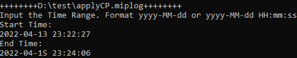
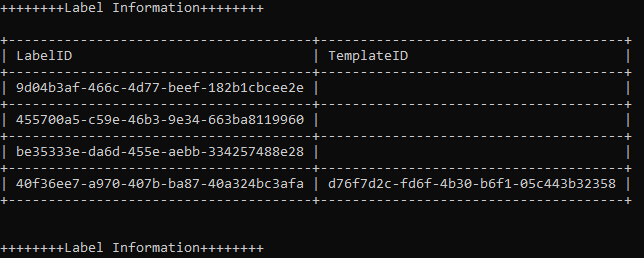
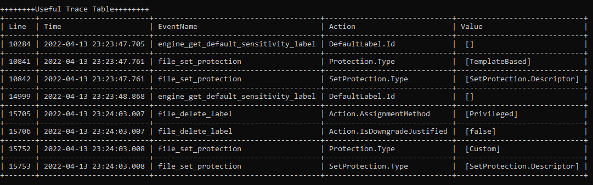

# Log Analyzer for MIP
This repository is for a tool to analyze MIP log.

For Microsoft Information Protection, we recommend visiting our official document: [Microsoft Information Protection](https://docs.microsoft.com/en-us/information-protection/develop/overview).

By default, the Microsoft Information Protection SDK sends diagnostic data to Microsoft. This data is useful for troubleshooting bugs, quality, and performance issues across the SDK install base. This tool is one module of "SmallTool" and helps with the analysis of MIP logs.

## Change Log


## Home Page 

[SmallTool](https://github.com/ChrisChenMS/SmallTool)

## Getting started
Run the tool by double click **SmallTool.exe**. Input the ***miplog** file path and we could get the analysis report.

This tool also uses **rules.json** file to define the requirements. **For MIP log analysis, we add new key-value pairs along with MSIPC objects.**
```json
{
   ...,
    "MIPMode":4,
    "MIPLogOnly":false
   }
}
```

 - MIPMode：

   1: Bootstrap

   This mode displays the basic bootstrap information.

   2: ErrorOnly

   This mode will focus on the error message in miplog files.

   3: Label

   This mode gives the output of the label and template information of the tenant.

   4: Trace

   This mode will filter out the useful telemetry and audit information from the log file which is useful for troubleshooting.

   5: All

   This mode generates a report including bootstrap information, error message, label and template information, and filtered useful trace.
   
- MIPLogOnly：

  true: Input the file path of *.miplog file.

  false: Input the **mip** folder path. It's under the path of MIP\ \<App name>.EXE.
  

Input the time range you want to filter the log. It could be **date** or **time**. Please notice if we input date, the time range will be "date 12:00:00 AM":



## Report Details

### Bootstrap analysis

This module analyzes the process of bootstrap, including Application Id, Application Name, Application Version, MIP SDK Version and Co-auth status. 


### Error Message

This module focuses on error message in the log file. It will display the error time and error line number, above the detailed error message.


### Label and Template

This module displays the label and template information for user's tenant.



### Trace information

This module focused on useful telemetry and event traces. It will display the number of different telemetry/audit in this log at beginning and then some filtered traces which are important to troubleshooting.

- The trace is group by Process ID. The tool will check the status first.
  
  
  
- **Connection Info:** The client will send some requests to server. Some telemetries have the request details which are helpful for troubleshooting.
  
  
  
- **Detailed Telemetry: **Based on our experience, we have filtered out some useful telemetries to display verbose information. 

  For example, this telemetry focus on the protection removal activity:

  
  
  - **Useful Trace Table: **This tool also has the feature to show some simple but useful events. We filtered the 
    Users could get related information from log files via the line number.
    
    
  - For Audit information, we skip the Heartbeat and Discover operation and display all detailed information for other operations since they could be informative. One example of the Change operation:
  
    
  
    This will show the label/protection information before and after. This could be great for us to know about the behavior since some time we could not have access to customer's confidential files or the issue could not be reproduced.

## Contributing

All the code for this Log Analyzer is available on GitHub. We will gladly accept contributions for the service, different modules, and the documentation.

